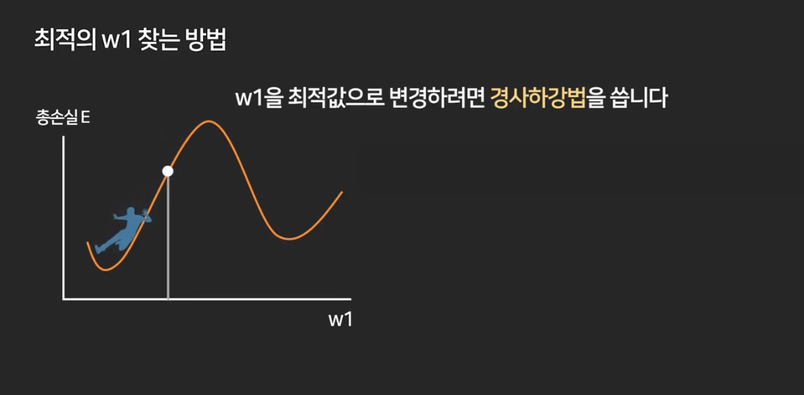

# DeepLearning-tutorial
딥러닝 튜토리얼입니다. 성킴 모두를 위한 딥러닝 시즌2 기반으로 제작되었습니다.
모든 코드는 [모두를 위한 딥러닝 시즌2](https://github.com/deeplearningzerotoall/TensorFlow.git) 을 가져다 쓴 것이며, 
이 깃허브페이지는 학습을 위해 만든 페이지 입니다.

## Linear Regression
tensorflow를 가지고 \[Linear Regression\]을 실습한 예제입니다.

```
import tensorflow as tf //텐서플로우 라이브러리
import numpy as np // 행렬이나 일반적으로 대규모 다차원 배열을 쉽게 처리 할 수 있도록 지원하는 파이썬의 라이브러리
tf.enable_eager_execution() // tensorflow 연산 실행 환경을 제공해 준다. (기존에는 그래프를 그려주는 모드가 기본이였지만, 명령형 프로그래밍 환경으로 바로 결과 값을 보여주는 모드이다.)

# Data
x_data = [1, 2, 3, 4, 5]
y_data = [1, 2, 3, 4, 5]

# W, b initialize
W = tf.Variable(2.9) // weight는 일반적으로 랜덤 값으로 설정된다.
b = tf.Variable(0.5) // bias(편향) 일반적으로 랜덤 값으로 설정된다.

# W, b update //오차의 합을 줄이는 연산을 실행
for i in range(100):
    # Gradient descent
    with tf.GradientTape() as tape: // GradientTape는 '경사하강법'으로 기본적으로 W,b를 찾아내는 알고리즘이다. W,b 값을 조금씩 줄여나가며 찾아낸다. 
        //linear regression 모델, 값 예측하기
        hypothesis = W * x_data + b
        // total 비용(error, cost, 오차)의 합을 구하는 코드 tf의 reduce_mean은 텐서플로우 차원을 줄이면서 연산을 함 (배열의 1차원 2차원)
        // 예측된 값과 실제 값의 오차의 합 -> Avg square sum
        cost = tf.reduce_mean(tf.square(hypothesis - y_data)) 
    
    // 경사하강법으로 W, b의 기울기를 계산
    W_grad, b_grad = tape.gradient(cost, [W, b])
    
    //learning_rate는 보통 아주 작은 값을 가진다. '경사하강법'과 같은 최적의 w,b 값을 찾는 알고리즘을 사용 할 때, Step size(낙폭)를 조절해 주는 역할을 한다.
    // W, b를 찾는 과정은 (new)W = (old)W - (stepSize * W_grad)
    W.assign_sub(learning_rate * W_grad) // tensorflow의 assign_sub 기능은  'y -= x' 와 같은 기능을 함
    b.assign_sub(learning_rate * b_grad)
    if i % 10 == 0:
      print("{:5}|{:10.4f}|{:10.4f}|{:10.6f}".format(i, W.numpy(), b.numpy(), cost))

print()

# predict
print(W * 5 + b)
print(W * 2.5 + b)
```
### 경사하강법

